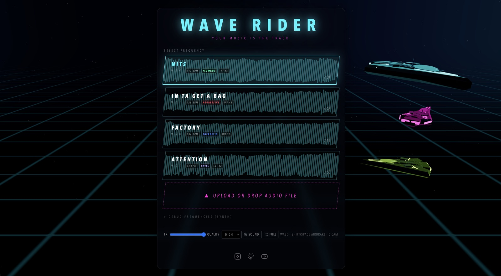
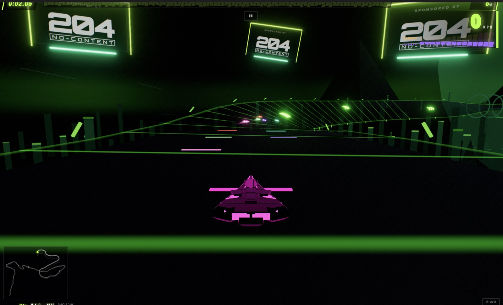

# WAVE RIDER

[](https://github.com/laubsauger/wave-rider/actions/workflows/deploy.yml)
[](https://github.com/laubsauger/wave-rider/stargazers)
[](https://github.com/laubsauger/wave-rider/commits/main)


**[Play it here](https://laubsauger.github.io/wave-rider/)** (needs a WebGPU browser)

Anti-gravity racing game where the track is generated from music. Pick one of the bundled songs or drop in your own file. The audio gets analyzed in the browser and turned into a course. Generation is deterministic, so the same file always produces the same track.





## How the music shapes the track

- BPM and energy set the pace: track length, curve speed, straights vs chicanes
- Drops become crest jumps with real airtime
- Breakdowns become glide sections and tunnels
- Busy high-energy passages spawn corkscrews, loops, wall rides and banked sweepers
- Section changes shift the color palette, sky and scenery
- Rails, pads and the skyline pulse with the live audio

## Features

- Client-side audio analysis (BPM, energy, sections, onsets, mood), no server
- WebGPU rendering with three.js and TSL, no WebGL fallback
- Bloom, depth of field, radial blur, heat shimmer at silly speeds
- 5 NPC racers, hull damage, explosions
- 1v1 multiplayer over WebRTC: the host sends the song file to the other player, both generate and race the same track
- Ghost replays you can share as a URL
- Keyboard and touch controls, quality tiers, phones play in landscape

## Running it

```sh
npm install
npm run dev
```

You need a browser with WebGPU (recent Chrome/Edge, Safari 26+).

```sh
npm test       # core test suite (analysis, generation, physics)
npm run build  # production build
```

## Controls

| Key | Action |
| --- | --- |
| WASD / arrows | steer + thrust |
| S / down | retro brake |
| Shift / Space | airbrakes |
| C | camera toggle |
| Esc | pause |
| M | mute |
| F2 | perf overlay |
